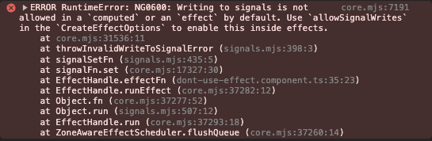

Alex Rickabaugh from Angluar Team in this [video](https://www.youtube.com/watch?v=aKxcIQMWSNU) said to no use effect at all.
I am still not that much into signals so I wanted to try it and understand why it is not recommended.

Official Angular documentation says:

> Avoid using effects for propagation of state changes. This can result in `ExpressionChangedAfterItHasBeenChecked` errors, infinite circular updates, or unnecessary change detection cycles.

```tsx
interface Option {
  id: number
  name: string
}

@Component({
  standalone: true,
  imports: [CommonModule, RouterModule],
  selector: 'dont-use-effect',
  template: ` <ul class="list-disc">
    @for (option of options(); track $index) {
    <li
      class="cursor-pointer"
      [class.underline]="option.id === selectedId()"
      (click)="selectedId.set(option.id)"
    >
      {{ option.name }}
    </li>
    }
  </ul>`,
})
export class DontUseEffectComponent {
  options = signal<Option[]>([])

  selectedId = signal<Option['id'] | null>(null)

  async ngOnInit(): Promise<void> {
    this.options.set(await this.getOptions())
  }

  public async getOptions(): Promise<Option[]> {
    return lastValueFrom(
      of([
        { id: 1, name: 'Apple' },
        { id: 2, name: 'Banana' },
      ]).pipe(delay(500))
    )
  }
}
```

In this example I have simple component where I can select Banana or Apple from options. Options are fetch from fake api which happens after component is initialized. After clicking option name, signal `selectedId` is set with id of option.

Let’s change it and extract component logic higher - to the parent component and pass options by input.

Parent component:

```tsx
@Component({
  // ...
  template: ` <child-component [options]="options()" />`,
})
export class DontUseEffectComponent {
  options = signal<Option[]>([])

  async ngOnInit(): Promise<void> {
    this.options.set(await this.getOptions())

    setTimeout(async () => this.options.set(await this.getOptions()), 3000) // <- simulated refetching
  }

  public async getOptions(): Promise<Option[]> {
    return lastValueFrom(
      of([
        { id: 1, name: 'Apple' },
        { id: 2, name: 'Banana' },
      ]).pipe(delay(500))
    )
  }
}
```

And child component:

```tsx
@Component({
  // ...
  selector: 'child-component',
  template: ` <ul class="list-disc">
    @for (option of options(); track $index) {
    <li
      class="cursor-pointer"
      [class.underline]="option.id === selectedId()"
      (click)="selectedId.set(option.id)"
    >
      {{ option.name }}
    </li>
    }
  </ul>`,
})
export class ChildComponent {
  options = input<Option[]>([])

  selectedId = signal<Option['id'] | null>(null)
}
```

Note that I simulated refetching data.

The problem now is - **how can we change `selectedId` when we change input and refetch data again?**

As a side effect of `options` signal change we could set selectedId in `effects`
.

```tsx
@Component({
  // ...
})
export class ChildComponent {
  options = input<Option[]>([])

  selectedId = signal<Option['id'] | null>(null)

  constructor() {
    effect(() => {
      this.selectedId.set(null)
    })
  }
}
```

This will not work because of two things. `effect` by default disallow to set signals directly. It rises an error:



We need to set `allowSignalWrites` explicitly.

Secondly, we need to set dependency of our input in effect by calling input signal.

```tsx
@Component({
 // ...
})
export class ChildComponent {
  options = input<Option[]>([]);

  selectedId = signal<Option['id'] | null>(null);

	effect(
	  () => {
		  this.options(); // <- set input signal is as dependency of effect

	    this.selectedId.set(null);
	  },
	  { allowSignalWrites: true } // <- explicitly allow signal writes
	);
}
```

This will work but it is really not clean way to do it.

We have `computed` function which is great api for this! But how to implement it?
Here magic comes.
We are creating signal with dependency of `options`.

```ts
@Component({
  // ...
  template: ` <ul class="list-disc">
    @for (option of state().options; track $index) {
    <li
      class="cursor-pointer"
      [class.underline]="option.id === state().selectedId()"
      (click)="state().selectedId.set(option.id)"
    >
      {{ option.name }}
    </li>
    }
  </ul>`,
})
export class ChildComponent {
  options = input<Option[]>([])

  state = computed(() => ({
    options: this.options(), // set options as dependency of computed
    selectedId: signal<number | null>(null), // every time options change, create new signal
  }))
}
```

This is something that require mindset shift. But I really like how it works and how it teaches signals concepts.

Josh Morony [compared](https://www.youtube.com/watch?v=IAmWwbKF2Ec&t=219s) `effect` to `subscribe` . I agree with that. The code with `effect` is just imperative like in `subscribe`.

`computed` function is much cleaner and especially - **declarative**.

I highly recommend you to write such an example by yourself - its eye-opening.
