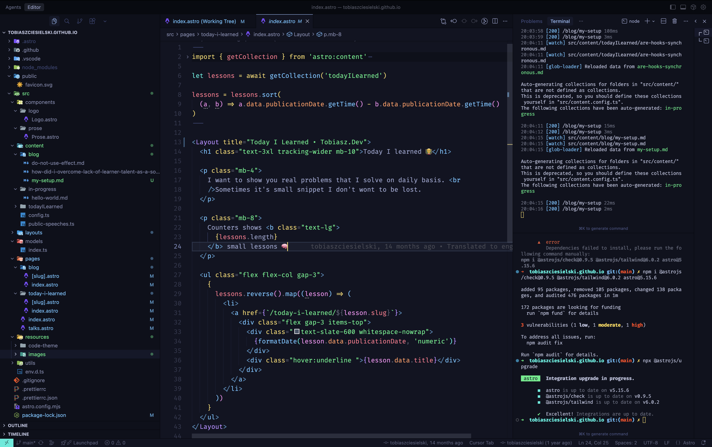

Last time I had an option to setup my new computer from scratch and I want to share everything I install and how I configure my IDE.


## Apps
- **Flycut** - this is the most important application of all. I install it instantly after initial setup. Clipboard with memory.
- **Google Chrome** - I've tried Arc, Brave, Dia and I was really impressed but I came to the basics and it turned out its the best fit for me.
- **Spark** - Email Client I love. It boost my productivity. Filtering unread emails and multi-account setup is great.
- **Spotify** - Must have.
- **Notion** - I dont have to introduce this to anyone.
- **QuickNote** - While Notion helps me to stay organized, this is my scratchpad. I use it for meeting notes, drafts etc. (fn+q)
- **Jomo** - Helps to to stay focused and don't fall into dump scrolling.
- **Grammarly** - Something I'm testing and I like it a lot!
- **Warp** - top tier terminal for me.
- **Slack** - my main comunicator. Remember to add [pepe emojis](https://slackmojis.com/emojis/1196-pepe) to it.


## IDE

I use **Cursor** which has the best in class autocompletion I overuse. I'm trying to adapt to agent mode. This is how it looks like:




### Settings:

```json
{
    "workbench.colorTheme": "Bearded Theme Arc Blueberry",
    "workbench.iconTheme": "material-icon-theme",
    "workbench.startupEditor": "none",
    "editor.fontFamily": "Fira Code",
    "editor.tabSize": 2,
    "editor.fontSize": 16,
    "editor.fontLigatures": true,
    "editor.formatOnSave": true,
    "editor.cursorBlinking": "expand",

    "editor.foldingImportsByDefault": true,
    "editor.codeActionsOnSave": {
        "source.removeUnusedImports": "always",
        "source.addMissingImports.ts": "always",
        "source.fixAll.eslint": "always",
        "source.sortImports": "always"
    },
    "[astro]": {
        "editor.defaultFormatter": "astro-build.astro-vscode"
    },
    "typescript.updateImportsOnFileMove.enabled": "always",
    "javascript.updateImportsOnFileMove.enabled": "always",
    "eslint.format.enable": true,
    "eslint.enable": true,
    "trailing-spaces.trimOnSave": true,
    "[typescriptreact]": {
        "editor.defaultFormatter": "esbenp.prettier-vscode"
    },
    "[typescript]": {
        "editor.defaultFormatter": "esbenp.prettier-vscode"
    },
    "[json]": {
        "editor.defaultFormatter": "esbenp.prettier-vscode"
    },
    "[css]": {
        "editor.defaultFormatter": "esbenp.prettier-vscode"
    },
    "[html]": {
        "editor.defaultFormatter": "esbenp.prettier-vscode"
    },
    "[javascript]": {
        "editor.defaultFormatter": "esbenp.prettier-vscode"
    },
    "security.workspace.trust.untrustedFiles": "open",
}
```

### Extensions:

- **Angular Language Service**
- **Astro**
- **Auto Close Tag**
- **Auto Rename Tag**
- **Bearded Theme**
- **ESLint**
- **GitLens - Git supercharged**
- **HTML CSS Support**
- **JavaScript and TypeScript Nightly**
- **Material Icon Theme**
- **npm Intellisense**
- **Prettier - Code formatter**
- **Pretty TypeScript Errors**
- **Tailwind CSS IntelliSense**
- **Trailing Spaces**
- **Typescript (Native Preview)**


## Hardware
- 💻 MacBook Pro 14", M4 Pro chip, 1TB and 48Gb of RAM.
- 🎧 EarPods and Air Pods 3
- 🖥️ Monitor Samsung C49RG90SSR
- 🐭 Apple Magic Mouse / Logitech MX Master 3
- ⌨️ Apple Magic Keyboard (ISO)

