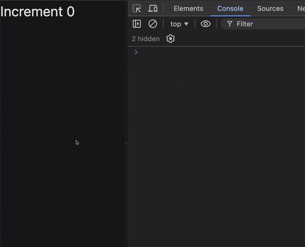
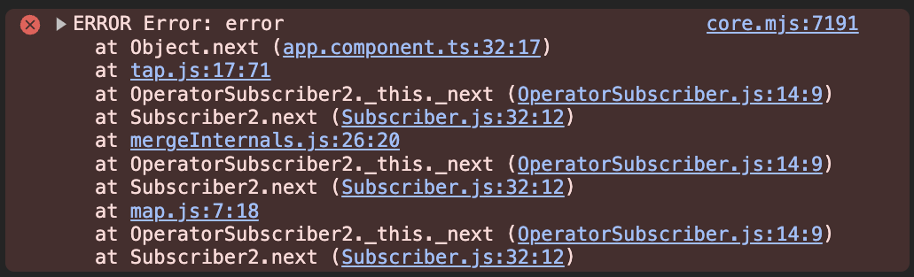

In code review saw code similar to this one:

```ts
  async ngOnInit() {
    await firstValueFrom(this.data$);
  }
```

I was wondering are angular hooks synchronous or not? Are they waiting for each other? What if error inside `ngOnInit` will be raised?

Lets find out :)

I've implemented this simple component with async functions in angular.

```ts
@Component({
  selector: 'app-root',
  standalone: true,
  changeDetection: ChangeDetectionStrategy.OnPush,
  template: `
    <button (click)="value = value + 1">Increment {{ value }}</button>
  `,
})
export class AppComponent implements OnInit {
  value = 0

  async ngOnInit() {
    await firstValueFrom(of('').pipe(delay(1000)))

    console.log('ngOnInit')
  }

  async ngDoCheck() {
    await firstValueFrom(of('').pipe(delay(1000)))

    console.log('ngDoCheck')
  }

  async ngAfterContentInit() {
    await firstValueFrom(of('').pipe(delay(1000)))

    console.log('ngAfterContentInit')
  }

  async ngAfterContentChecked() {
    await firstValueFrom(of('').pipe(delay(1000)))

    console.log('ngAfterContentChecked')
  }

  async ngAfterViewInit() {
    await firstValueFrom(of('').pipe(delay(1000)))

    console.log('ngAfterViewInit')
  }

  async ngAfterViewChecked() {
    await firstValueFrom(of('').pipe(delay(1000)))

    console.log('ngAfterViewChecked')
  }
}
```

And after entering browser and interacting with UI, everything is working fine.



But what if we spot an error in ngOnInit?

```ts
  async ngOnInit() {
    await firstValueFrom(
      of('').pipe(
        delay(1000),
        tap(() => {
          throw new Error('error');
        })
      )
    );

    console.log('ngOnInit');
  }
```

Without handling error we get error in our browser console but the component is still ready to interact with.



Ok but it is just playing with UI. Lets dive deeper to answer - WHY?

I did little investigation in Angular source code 👀

Inside `node_modules/@angular/core/fesm2022/core.mjs` we can find such function:

```js
function callHookInternal(directive, hook) {
  profiler(4 /* ProfilerEvent.LifecycleHookStart */, directive, hook)
  const prevConsumer = setActiveConsumer$1(null)
  try {
    hook.call(directive)
  } finally {
    setActiveConsumer$1(prevConsumer)
    profiler(5 /* ProfilerEvent.LifecycleHookEnd */, directive, hook)
  }
}
```

First argument of [call](https://developer.mozilla.org/en-US/docs/Web/JavaScript/Reference/Global_Objects/Function/call) function is execution context. `hook.call(directive);` calls hook with context of `directive`.

Based on this implementation and quick investigation I am sure Angular hooks are just pure callback functions that are independent. Using then with async await will not brake anything because they are separated from angular logic.

But is it good practice ❗️❓

I am far to say it's good or bad practice. I think it is important to be aware what are we doing. We can achieve such behavior by using [resolver](https://angular.dev/api/router/ResolveFn).

---

Further reading:

- https://stackoverflow.com/questions/56092083/async-await-in-angular-ngoninit
